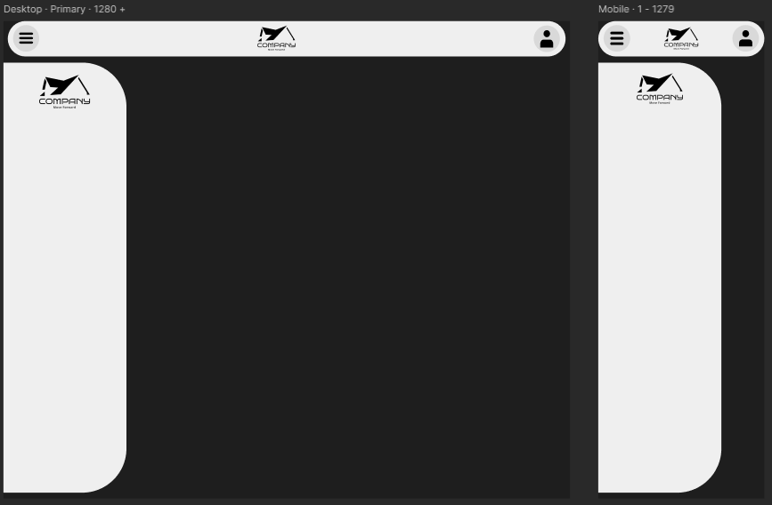
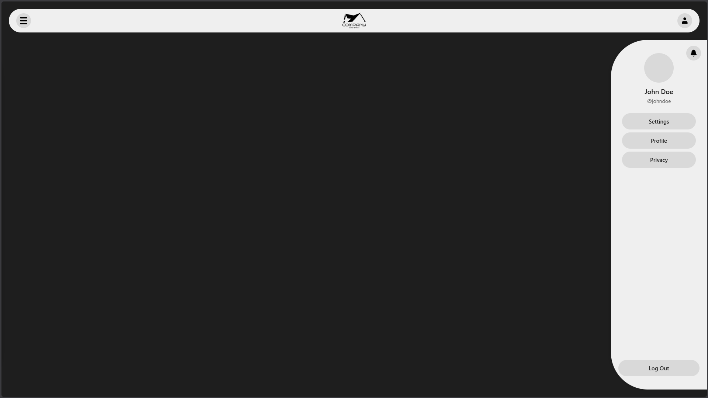

# Navbar & Notification System

A clean, modern navigation component with sliding sidebars and a minimal notification toast system.

[](https://SkenSMasteR.github.io/dual-drawer-navbar/)


## Screenshots

<details>
<summary><strong>Design</strong></summary>

<br>



</details>

<details>
<summary><strong>Live</strong></summary>

<br>



</details>

## Third-Party Assets
<details>
<summary><strong>Logo</strong></summary>

- **House logo**
  - **Source:** https://www.vecteezy.com/vector-art/226305-house-logo-vector
  - **Author:** **Pien Duijverman**

</details>


## Notification API

<details>
<summary><strong>Basic Notification</strong></summary>

```javascript
// Basic notification with default type (none)
notification.trigger('Hello World!')
```

</details>

<details>
<summary><strong>Info Notification</strong></summary>

```javascript
// Info type
notification.trigger('This is an info message', 'info')
```

</details>

<details>
<summary><strong>Success Notification</strong></summary>

```javascript
// Success type
notification.trigger('Operation completed successfully!', 'success')
```

</details>

<details>
<summary><strong>Error Notification</strong></summary>

```javascript
// Error type
notification.trigger('Something went wrong!', 'error')
```

</details>

<details>
<summary><strong>None Notification</strong></summary>

```javascript
// None type (explicit)
notification.trigger('Plain notification', 'none')
```

</details>

<details>
<summary><strong>Multiple Notifications</strong></summary>

```javascript
// Multiple notifications in sequence
notification.trigger('First toast', 'info')

setTimeout(() => {
  notification.trigger('Second toast', 'success')
}, 500)

setTimeout(() => {
  notification.trigger('Third toast', 'error')
}, 1000)
```

</details>

<details>
<summary><strong>Long Message</strong></summary>

```javascript
// Long message
notification.trigger(
  'This is a very long notification message that will still display properly',
  'info'
)
```

</details>

<details>
<summary><strong>Empty Message Fallback</strong></summary>

```javascript
// Empty message fallback
notification.trigger('', 'success')
```

</details>

<details>
<summary><strong>Invalid Type Fallback</strong></summary>

```javascript
// Invalid type falls back to 'none'
notification.trigger('Invalid type test', 'warning')
```

</details>

## Author

SkenS - https://github.com/SkenSMasteR
